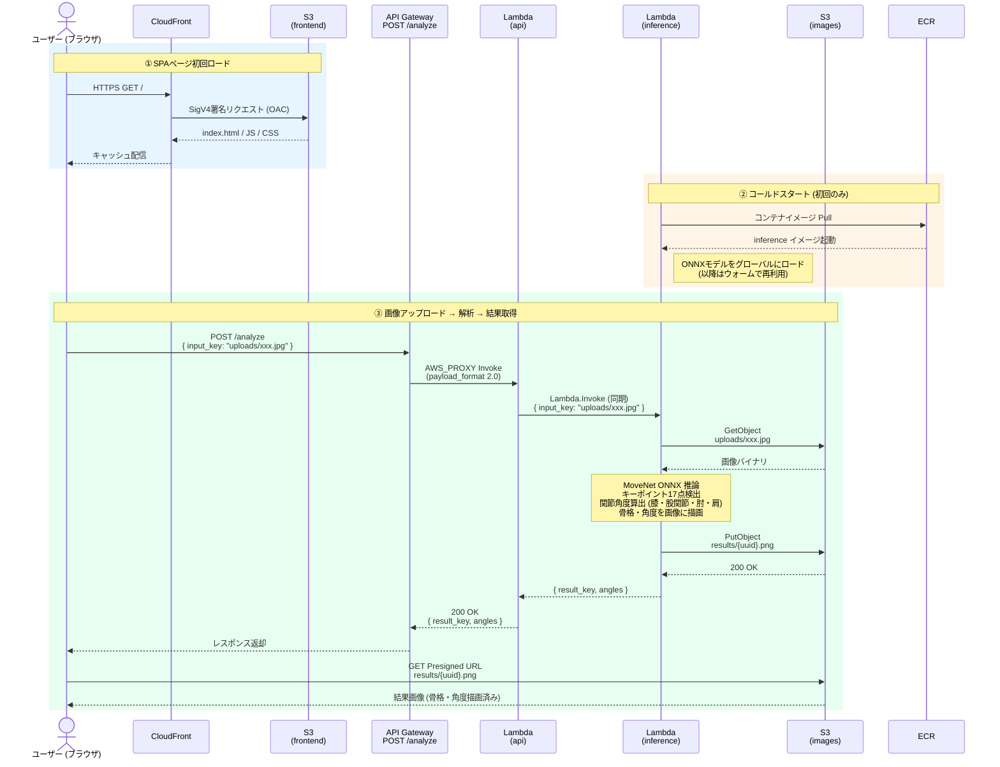

# Bike Fitting Analyzer

バイクフィッティング分析を行うAI推論システムです。MoveNetによる姿勢推定を使用して、自転車乗車時の身体の角度を自動測定します。

## プロジェクト概要

このシステムは、ユーザーがアップロードした自転車乗車画像から、以下の情報を自動的に解析します：

- **17個のキーポイント検出**: 鼻、目、耳、肩、肘、手首、腰、膝、足首
- **8つの関節角度測定**: 左右の膝・股関節・肘・肩の角度
- **可視化された結果画像**: 骨格線、角度の弧、数値が描画された画像

バイクフィッターや自転車愛好家が、乗車姿勢を客観的に評価できます。

---

## システムアーキテクチャ

```
[User]
  ↓ アップロード
[CloudFront] ← フロントエンド配信 (S3)
  ↓ API リクエスト
[API Gateway] ← POST /analyze
  ↓
[API Lambda]
  ├→ [S3 Images] ← 画像保存・取得
  └→ [Inference Lambda (Docker)] ← 推論実行
      ├→ [MoveNet ONNX Model] ← 姿勢推定
      └→ [S3 Images] ← 結果画像保存
```

### 主要AWSサービス

| サービス               | 役割                   | 備考                                           |
| ---------------------- | ---------------------- | ---------------------------------------------- |
| **CloudFront**         | フロントエンド配信     | S3上の静的HTMLをHTTPS配信、SPA対応             |
| **API Gateway**        | RESTful API            | HTTP API、CORS有効、スロットリング設定済み     |
| **Lambda (API)**       | APIハンドラ            | Python 3.12、メモリ256MB、タイムアウト30秒     |
| **Lambda (Inference)** | AI推論実行             | Dockerコンテナ、メモリ1024MB、タイムアウト30秒 |
| **ECR**                | Dockerイメージ保存     | Lambda用コンテナイメージを格納                 |
| **S3 (Frontend)**      | 静的サイトホスティング | CloudFront経由でのみアクセス可能               |
| **S3 (Images)**        | 画像ストレージ         | 入力画像・結果画像を保存、30日で自動削除       |
| **IAM**                | 権限管理               | Lambda実行ロール、S3アクセス権限               |
| **Budget**             | コスト管理             | 月額5ドル予算、80%/100%でアラート              |

---

## 技術スタック

### AI / ML

- **MoveNet Lightning (ONNX)**: Googleの軽量姿勢推定モデル
  - 入力: 192x192 RGB画像 (int32)
  - 出力: 17個のキーポイント座標 (y, x, confidence)
  - モデルサイズ: 約4.8MB

### バックエンド

- **Python 3.12**: Lambda実行環境
- **ONNX Runtime**: 高速推論エンジン
- **OpenCV (Headless)**: 画像処理・描画
- **Boto3**: AWS SDK for Python

### インフラストラクチャ

- **Terraform 1.0+**: Infrastructure as Code
- **Docker**: Lambda用コンテナイメージ
- **AWS Lambda (Container)**: サーバーレス実行環境

---

## ディレクトリ構成

```
bike-fitting-analyzer/
├── lambda/
│   ├── api/
│   │   └── handler.py              # APIエンドポイントのハンドラ (placeholder)
│   └── inference/
│       ├── handler.py               # 推論Lambda (MoveNet実行 + 角度計算)
│       ├── Dockerfile               # Lambda用コンテナイメージ定義
│       ├── requirements.txt         # Python依存パッケージ
│       └── movenet_lightning.onnx   # MoveNetモデル (4.8MB)
├── terraform/
│   ├── main.tf                      # Terraformプロバイダ設定
│   ├── lambda.tf                    # Lambda関数・ECR定義
│   ├── s3.tf                        # S3バケット定義
│   ├── api_gateway.tf               # API Gateway定義
│   ├── cloudfront.tf                # CloudFront + OAC定義
│   ├── iam.tf                       # IAMロール・ポリシー定義
│   ├── budget.tf                    # AWS Budget設定
│   ├── variables.tf                 # 変数定義
│   └── outputs.tf                   # 出力値定義
├── models/
│   ├── movenet_lightning.onnx       # ONNXモデル (メイン)
│   ├── movenet_lightning.tar.gz     # 元のモデルアーカイブ
│   └── movenet_saved_model/         # TensorFlow SavedModel形式
├── test_images/
│   ├── position.png                 # テスト用入力画像
│   └── result.png                   # テスト用出力画像
├── inference.py                     # ローカル実行用スクリプト
└── README.md                        # このファイル
```

---

## シーケンス図



---

## 主要コンポーネントの詳細解説

### 1. MoveNet Lightning モデル

**MoveNet**はGoogleが開発した高速・軽量な姿勢推定モデルです。

#### モデルの特徴

- **Lightning版**: 速度重視（Thunder版は精度重視）
- **入力サイズ**: 192x192ピクセル (int32形式)
- **推論速度**: CPUでも高速動作（Lambda環境で1秒以内）
- **検出可能な部位**: 17個のキーポイント

#### キーポイント一覧

```python
[0] nose          # 鼻
[1] left_eye      # 左目
[2] right_eye     # 右目
[3] left_ear      # 左耳
[4] right_ear     # 右耳
[5] left_shoulder # 左肩
[6] right_shoulder# 右肩
[7] left_elbow    # 左肘
[8] right_elbow   # 右肘
[9] left_wrist    # 左手首
[10] right_wrist  # 右手首
[11] left_hip     # 左腰
[12] right_hip    # 右腰
[13] left_knee    # 左膝
[14] right_knee   # 右膝
[15] left_ankle   # 左足首
[16] right_ankle  # 右足首
```

#### 出力形式

```python
shape: (1, 1, 17, 3)
各キーポイント: [y, x, confidence]
  - y, x: 0.0〜1.0 の正規化座標
  - confidence: 0.0〜1.0 の信頼度スコア
```

#### 前処理・後処理

```python
# 前処理
resized = cv2.resize(image, (192, 192))
input_data = np.expand_dims(resized, axis=0).astype(np.int32)

# 推論
outputs = session.run(None, {input_name: input_data})
keypoints_raw = outputs[0][0][0]  # shape: (17, 3)

# 後処理 (正規化座標 → ピクセル座標)
for kp in keypoints_raw:
    y, x, conf = kp
    pixel_x = int(x * original_width)
    pixel_y = int(y * original_height)
```

---

### 2. Lambda関数 (Inference)

#### handler.py の処理フロー

```python
lambda_handler(event, context):
    1. S3から入力画像を取得 (event["input_key"])
    2. run_inference() で推論実行
       - 画像デコード (cv2.imdecode)
       - リサイズ (192x192)
       - ONNX Runtime で推論
       - キーポイントをピクセル座標に変換
    3. draw_results() で可視化
       - 骨格線を描画
       - キーポイントを円で描画
       - 角度計算 (calculate_angle)
       - 角度の弧・数値を描画
       - サマリーパネルを描画
    4. 結果画像をS3にアップロード (results/{uuid}.png)
    5. レスポンス返却 (result_key, angles)
```

#### 角度計算のアルゴリズム

3点 (p1, p2, p3) から頂点 p2 の角度を計算します。

```python
def calculate_angle(p1, p2, p3):
    # ベクトル作成
    v1 = p1 - p2  # p2 → p1
    v2 = p3 - p2  # p2 → p3

    # 内積からコサイン値を計算
    cos_angle = dot(v1, v2) / (norm(v1) * norm(v2))

    # 角度に変換（度数法）
    angle = arccos(cos_angle) * 180 / π
    return angle
```

**計測される8つの角度**:

| 角度           | 頂点 | 構成点               | 説明                 |
| -------------- | ---- | -------------------- | -------------------- |
| Left Knee      | 左膝 | (左腰, 左膝, 左足首) | ペダリング効率に影響 |
| Right Knee     | 右膝 | (右腰, 右膝, 右足首) | ペダリング効率に影響 |
| Left Hip       | 左腰 | (左肩, 左腰, 左膝)   | 前傾姿勢の指標       |
| Right Hip      | 右腰 | (右肩, 右腰, 右膝)   | 前傾姿勢の指標       |
| Left Elbow     | 左肘 | (左肩, 左肘, 左手首) | ハンドル位置の指標   |
| Right Elbow    | 右肘 | (右肩, 右肘, 右手首) | ハンドル位置の指標   |
| Left Shoulder  | 左肩 | (左肘, 左肩, 左腰)   | 上半身の姿勢         |
| Right Shoulder | 右肩 | (右肘, 右肩, 右腰)   | 上半身の姿勢         |

---

### 3. Dockerfile (Lambda Container)

```dockerfile
FROM public.ecr.aws/lambda/python:3.12

# OpenCVの依存ライブラリをインストール
RUN dnf install -y mesa-libGL && dnf clean all

# Pythonパッケージをインストール
COPY requirements.txt .
RUN pip install --no-cache-dir -r requirements.txt

# モデルファイルをコピー (/opt/ml/model/ にモデルを配置)
COPY movenet_lightning.onnx /opt/ml/model/movenet_lightning.onnx

# ハンドラーをコピー
COPY handler.py ${LAMBDA_TASK_ROOT}/

CMD ["handler.lambda_handler"]
```

#### ポイント

- **ベースイメージ**: AWS公式のLambda Python 3.12イメージ
- **mesa-libGL**: OpenCVが画像処理に必要とする共有ライブラリ
- **モデルの配置**: `/opt/ml/model/` にONNXモデルを配置
- **コールドスタート対策**: `get_session()` でグローバル変数にモデルをキャッシュ

---

### 4. Terraform設定

#### lambda.tf - Lambda関数定義

```hcl
resource "aws_lambda_function" "inference" {
  function_name = "bike-fitting-inference-dev"
  package_type  = "Image"  # コンテナイメージ
  image_uri     = "${aws_ecr_repository.inference.repository_url}:latest"

  memory_size = 1024  # ONNX Runtimeの推論に必要
  timeout     = 30

  environment {
    variables = {
      S3_BUCKET_IMAGES = aws_s3_bucket.images.bucket
    }
  }
}
```

**メモリ設定の根拠**:

- OpenCV + ONNX Runtime + モデルロード: 約500MB
- 画像処理バッファ: 約200MB
- 余裕を持たせて1024MB設定

#### s3.tf - S3バケット定義

```hcl
# ライフサイクルルール (30日で自動削除)
resource "aws_s3_bucket_lifecycle_configuration" "images" {
  rule {
    id     = "auto-delete"
    status = "Enabled"
    expiration {
      days = 30
    }
  }
}

# CORS設定 (ブラウザからのPresigned URLアクセス用)
resource "aws_s3_bucket_cors_configuration" "images" {
  cors_rule {
    allowed_headers = ["*"]
    allowed_methods = ["GET", "PUT"]
    allowed_origins = ["*"]  # 本番では CloudFront ドメインに限定
    max_age_seconds = 3600
  }
}
```

**ライフサイクルルールの理由**:

- PoCプロジェクトのため長期保存不要
- ストレージコスト削減
- 個人情報保護の観点

#### cloudfront.tf - CloudFront配信

```hcl
# OAC (Origin Access Control) - 新方式のS3アクセス制御
resource "aws_cloudfront_origin_access_control" "frontend" {
  origin_access_control_origin_type = "s3"
  signing_behavior                  = "always"
  signing_protocol                  = "sigv4"
}
```

**OACの利点**:

- OAI (Origin Access Identity) の後継機能
- より安全な署名方式 (SigV4)
- S3バケットポリシーで厳密に制御可能

#### iam.tf - IAM権限設計

```hcl
# Lambda実行ロール
aws_iam_role.lambda_role
  ├─ AssumeRole: lambda.amazonaws.com のみ
  ├─ AWSLambdaBasicExecutionRole (CloudWatch Logs書き込み)
  ├─ S3 GetObject/PutObject (imagesバケットのみ)
  └─ lambda:InvokeFunction (推論Lambda呼び出し)
```

**最小権限の原則**:

- 必要なリソースのみにアクセス許可
- バケット単位でResource ARNを限定
- CloudWatch Logsは自動でロググループ作成

#### budget.tf - コスト管理

```hcl
resource "aws_budgets_budget" "monthly" {
  limit_amount = "5"  # 月額5ドル
  limit_unit   = "USD"

  # 実コストが80%に達したら通知
  notification {
    threshold      = 80
    notification_type = "ACTUAL"
  }

  # 予測コストが100%に達したら通知
  notification {
    threshold      = 100
    notification_type = "FORECASTED"
  }
}
```

**PoCプロジェクトのコスト試算**:

- Lambda実行: 月100回 × 5秒 ≈ $0.10
- S3ストレージ: 10GB × 30日 ≈ $0.23
- API Gateway: 月100リクエスト ≈ $0.01
- CloudFront: 月1GB転送 ≈ $0.085
- **合計**: 約$0.50/月 (予算の10%)

---

## データフロー

### 画像アップロード〜解析結果取得

```
1. [User]
   ↓ POST /analyze (multipart/form-data)

2. [API Gateway]
   ↓ Lambda統合 (Proxy)

3. [API Lambda]
   ├→ S3.put_object(input_image)  # 入力画像保存
   ↓
   └→ lambda.invoke(inference_function, {"input_key": "..."})

4. [Inference Lambda]
   ├→ S3.get_object(input_key)      # 画像取得
   ├→ ONNX Runtime 推論実行          # キーポイント検出
   ├→ 角度計算・可視化               # 結果画像生成
   └→ S3.put_object(result_image)   # 結果画像保存

5. [API Lambda]
   ←─ {"result_key": "...", "angles": {...}}
   ↓

6. [API Gateway]
   ←─ JSON レスポンス
   ↓

7. [User]
   ←─ {"result_key": "results/xxx.png", "angles": {...}}
   ↓ S3 Presigned URL or CloudFront経由で画像取得
```

---

## デプロイ方法

### 前提条件

- AWS CLI設定済み (`aws configure`)
- Terraform 1.0+ インストール済み
- Docker インストール済み

### 1. Dockerイメージのビルド・プッシュ

```bash
# ECRにログイン
aws ecr get-login-password --region ap-northeast-1 | \
  docker login --username AWS --password-stdin <account-id>.dkr.ecr.ap-northeast-1.amazonaws.com

# Dockerイメージをビルド
cd lambda/inference
docker build --platform linux/amd64 -t bike-fitting-inference .

# タグ付け
docker tag bike-fitting-inference:latest \
  <account-id>.dkr.ecr.ap-northeast-1.amazonaws.com/bike-fitting-inference:latest

# ECRにプッシュ
docker push <account-id>.dkr.ecr.ap-northeast-1.amazonaws.com/bike-fitting-inference:latest
```

**注意**: M1/M2 Macの場合は `--platform linux/amd64` が必須

### 2. Terraformでインフラをデプロイ

```bash
cd terraform

# 初期化
terraform init

# 変数ファイル作成 (terraform.tfvars)
cat <<EOF > terraform.tfvars
aws_region   = "ap-northeast-1"
project_name = "bike-fitting"
environment  = "dev"
alert_email  = "your-email@example.com"
EOF

# 変更内容を確認
terraform plan

# デプロイ実行
terraform apply
```

### 3. デプロイ後の確認

```bash
# エンドポイントURLを確認
terraform output api_endpoint
# → https://xxxxxxxxxx.execute-api.ap-northeast-1.amazonaws.com

terraform output cloudfront_url
# → https://xxxxxxxxxx.cloudfront.net
```

---

## ローカル開発

### 推論スクリプトの実行

```bash
# 依存パッケージをインストール
pip install onnxruntime opencv-python numpy

# 推論実行
python inference.py test_images/position.png

# 出力
# → test_images/result.png に結果画像が保存される
```

### Dockerイメージのローカルテスト

```bash
cd lambda/inference

# イメージをビルド
docker build -t bike-fitting-inference .

# Lambda Runtime Interface Emulator (RIE) で起動
docker run -p 9000:8080 bike-fitting-inference

# 別ターミナルからテスト実行
curl -XPOST "http://localhost:9000/2015-03-31/functions/function/invocations" \
  -d '{"input_key": "test.png"}'
```

---

## コスト管理

### 予算アラート設定

Budgetリソースにより、以下のタイミングでメール通知されます：

- **80%到達時** (実コスト): 月額$4.00
- **100%予測時** (予測コスト): 月末に$5.00を超える予測

### コスト最適化のポイント

1. **Lambda**
   - メモリサイズを必要最小限に設定 (1024MB)
   - タイムアウトを短く設定 (30秒)
   - コールドスタート対策 (グローバル変数でモデルキャッシュ)

2. **S3**
   - ライフサイクルルールで30日自動削除
   - 不要なバージョニング無効

3. **API Gateway**
   - スロットリング設定 (burst: 10, rate: 5/秒)
   - 不正アクセス防止

4. **CloudFront**
   - キャッシュ有効化 (静的ファイルの配信コスト削減)

---

## トラブルシューティング

### Lambda実行エラー

**エラー**: `Could not decode image`

- **原因**: S3から取得した画像が破損している
- **対処**: 画像のContent-Typeが正しいか確認

**エラー**: `Memory exhausted`

- **原因**: メモリ不足
- **対処**: `lambda.tf` の `memory_size` を増やす (1536MB など)

**エラー**: `Model not found`

- **原因**: Dockerイメージにモデルが含まれていない
- **対処**: `Dockerfile` の `COPY` 命令を確認、再ビルド

### Terraform適用エラー

**エラー**: `ResourceAlreadyExistsException: ECR repository already exists`

- **原因**: 以前のデプロイが残っている
- **対処**: `terraform import` で既存リソースをインポート

```bash
terraform import aws_ecr_repository.inference bike-fitting-inference
```

---

## 今後の改善案

### 機能追加

- [ ] フロントエンドの実装 (React + TypeScript)
- [ ] ユーザー認証 (Cognito)
- [ ] 履歴管理機能 (DynamoDB)
- [ ] 理想的な角度との比較機能
- [ ] PDF形式での分析レポート出力

### パフォーマンス

- [ ] Lambda Provisioned Concurrency (コールドスタート解消)
- [ ] 画像圧縮 (WebP形式への変換)
- [ ] API Gateway キャッシング

### セキュリティ

- [ ] CloudFrontでのWAF設定
- [ ] API Keyによるアクセス制御
- [ ] S3バケットの暗号化 (SSE-S3)

### 運用

- [ ] CloudWatch Logs Insights でのログ分析
- [ ] X-Rayトレーシング
- [ ] アラート設定 (エラー率、レイテンシ)

---

## 学習スタイル

このプロジェクトは以下の学習アプローチで作成されました：

1. **Claude に要件を伝える**: やりたいことを明確に伝え、TerraformやLambdaのコードを生成してもらう
2. **コードを深く理解する**: 生成されたコードについて質問し、人に説明できるレベルまで理解する
3. **実装と検証**: 実際にデプロイして動作を確認し、問題があれば修正する

**学習のポイント**:

- なぜこの設定が必要なのか？
- 他の実装方法との違いは？
- 本番環境で使う場合の改善点は？

これらを常に考えながら実装することで、AWSやTerraformの深い理解が得られます。

---

## 参考資料

- [MoveNet公式ドキュメント](https://www.tensorflow.org/hub/tutorials/movenet)
- [AWS Lambda コンテナイメージ](https://docs.aws.amazon.com/lambda/latest/dg/images-create.html)
- [Terraform AWS Provider](https://registry.terraform.io/providers/hashicorp/aws/latest/docs)
- [ONNX Runtime](https://onnxruntime.ai/)

---

## ライセンス

このプロジェクトはPoC（概念実証）として作成されたものです。
